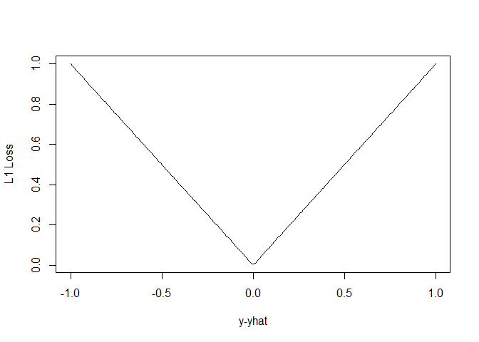
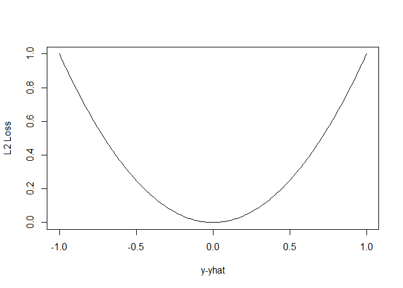
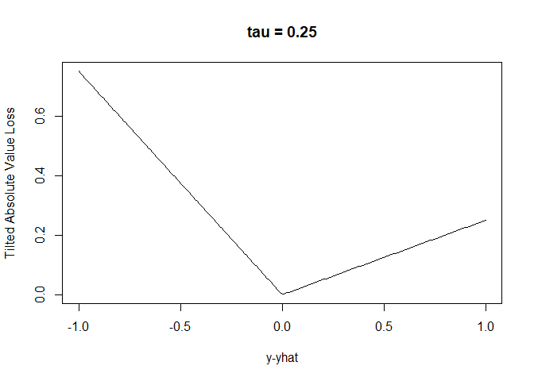
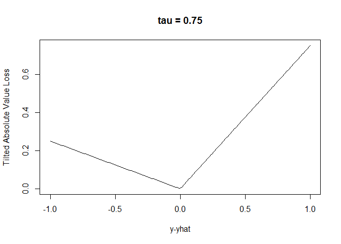
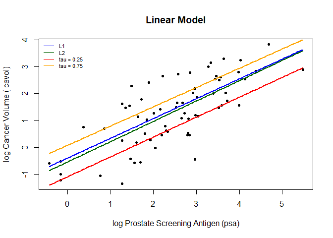
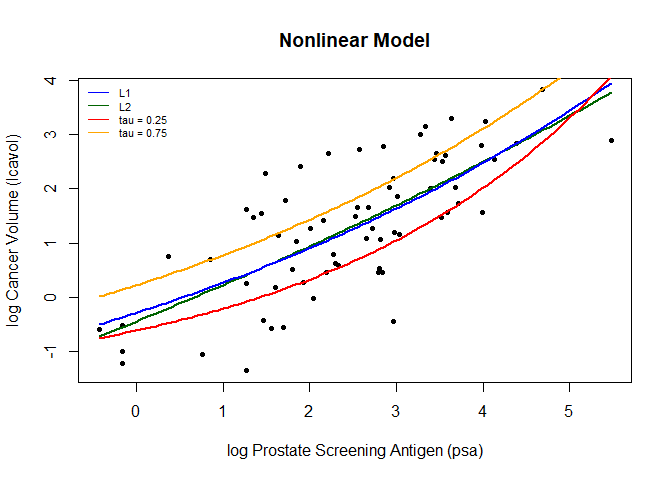

Homework 2
================
Jingyuan Wu
2/1/2022

## Instruction

Using the RMarkdown/knitr/github mechanism, implement the following
tasks by extending the example R script ( prostate-data-lin.R):

Write functions that implement the L1 loss and tilted absolute loss
functions.

Create a figure that shows lpsa (x-axis) versus lcavol (y-axis). Add and
label (using the ‘legend’ function) the linear model predictors
associated with L2 loss, L1 loss, and tilted absolute value loss for tau
= 0.25 and 0.75.

Write functions to fit and predict from a simple nonlinear model with
three parameters defined by ‘beta\[1\] + beta\[2\]*exp(-beta\[3\]*x)’.
Hint: make copies of ‘fit\_lin’ and ‘predict\_lin’ and modify them to
fit the nonlinear model. Use c(-1.0, 0.0, -0.3) as ‘beta\_init’.

Create a figure that shows lpsa (x-axis) versus lcavol (y-axis). Add and
label (using the ‘legend’ function) the nonlinear model predictors
associated with L2 loss, L1 loss, and tilted absolute value loss for tau
= 0.25 and 0.75.

## Linear Model

``` r
## load prostate data
prostate <- 
  read.table(url(
    'https://web.stanford.edu/~hastie/ElemStatLearn/datasets/prostate.data'))

## subset to training examples
prostate_train <- subset(prostate, train==TRUE)

## plot lcavol vs lpsa
plot_psa_data <- function(dat=prostate_train) {
  plot(dat$lpsa, dat$lcavol,
       xlab="log Prostate Screening Antigen (psa)",
       ylab="log Cancer Volume (lcavol)",
       pch = 20)
}
#plot_psa_data()

############################
## regular linear regression
############################

## L2 loss function
L2_loss <- function(y, yhat)
  (y-yhat)^2

## L1 loss function
L1_loss <- function(y, yhat)
  abs(y-yhat)

## Tilted absolute loss function
Tilted_abs_loss <- function(y, yhat, tau)
  ifelse((y-yhat)>0, (tau * (y-yhat)), ((tau-1) * (y-yhat)))

Tilted_abs_loss_1 <- function(y, yhat)
  ifelse((y-yhat)>0, (0.25 * (y-yhat)), ((0.25-1) * (y-yhat)))
Tilted_abs_loss_2 <- function(y, yhat)
  ifelse((y-yhat)>0, (0.75 * (y-yhat)), ((0.75-1) * (y-yhat)))

## plot custom loss function
err_grd <- seq(-1,1,length.out=200)
plot(err_grd, L1_loss(err_grd,0), type='l',
     xlab='y-yhat', ylab='L1 Loss')
```

<!-- -->

``` r
plot(err_grd, L2_loss(err_grd,0), type='l',
     xlab='y-yhat', ylab='L2 Loss')
```

<!-- -->

``` r
plot(err_grd, Tilted_abs_loss_1(err_grd,0), type='l',
     xlab='y-yhat', ylab='Tilted Absolute Value Loss',main="tau = 0.25")
```

<!-- -->

``` r
plot(err_grd, Tilted_abs_loss_2(err_grd,0), type='l',
     xlab='y-yhat', ylab='Tilted Absolute Value Loss',main="tau = 0.75")
```

<!-- -->

``` r
## fit simple linear model using numerical optimization
fit_lin_l2 <- function(y, x, loss=L2_loss, beta_init = c(-0.51, 0.75)) {
  err <- function(beta)
    mean(loss(y,  beta[1] + beta[2]*x))
  beta <- optim(par = beta_init, fn = err)
  return(beta)
}

fit_lin_l1 <- function(y, x, loss=L1_loss, beta_init = c(-0.51, 0.75)) {
  err <- function(beta)
    mean(loss(y,  beta[1] + beta[2]*x))
  beta <- optim(par = beta_init, fn = err)
  return(beta)
}

fit_lin_ta1 <- function(y, x, loss=Titlted_abs_loss_1, beta_init = c(-0.51, 0.75)) {
  err <- function(beta)
    mean(loss(y,  beta[1] + beta[2]*x))
  beta <- optim(par = beta_init, fn = err)
  return(beta)
}
fit_lin_ta2 <- function(y, x, loss=Titlted_abs_loss_2, beta_init = c(-0.51, 0.75)) {
  err <- function(beta)
    mean(loss(y,  beta[1] + beta[2]*x))
  beta <- optim(par = beta_init, fn = err)
  return(beta)
}

## make predictions from linear model
predict_lin <- function(x, beta)
  beta[1] + beta[2]*x

## fit linear model
lin_beta_l2 <- fit_lin_l2(y=prostate_train$lcavol,
                    x=prostate_train$lpsa,
                    loss=L2_loss)

## fit linear model
lin_beta_l1 <- fit_lin_l1(y=prostate_train$lcavol,
                    x=prostate_train$lpsa,
                    loss=L1_loss)

## fit linear model
lin_beta_ta1 <- fit_lin_ta1(y=prostate_train$lcavol,
                    x=prostate_train$lpsa,
                    loss=Tilted_abs_loss_1)

## fit linear model
lin_beta_ta2 <- fit_lin_ta2(y=prostate_train$lcavol,
                    x=prostate_train$lpsa,
                    loss=Tilted_abs_loss_2)

## compute predictions for a grid of inputs
x_grid <- seq(min(prostate_train$lpsa),
              max(prostate_train$lpsa),
              length.out=100)
lin_pred_l2 <- predict_lin(x=x_grid, beta=lin_beta_l2$par)
lin_pred_l1 <- predict_lin(x=x_grid, beta=lin_beta_l1$par)
lin_pred_ta1 <- predict_lin(x=x_grid, beta=lin_beta_ta1$par)
lin_pred_ta2 <- predict_lin(x=x_grid, beta=lin_beta_ta2$par)
## plot data
plot_psa_data()

## plot predictions
lines(x=x_grid, y=lin_pred_l2, col='darkgreen', lwd=2)
lines(x=x_grid, y=lin_pred_l1, col='blue', lwd=2)
lines(x=x_grid, y=lin_pred_ta1, col='red', lwd=2)
lines(x=x_grid, y=lin_pred_ta2, col='orange', lwd=2)
legend("topleft", c("L1","L2","tau = 0.25","tau = 0.75"), lty=c(1,1,1,1), bty = "n", cex=.7, col=c("blue", "darkgreen", "red", "orange"))
title("Linear Model")
```

<!-- -->

## Nonlinear Model

``` r
fit_nlm_l2<-function(y, x, loss=L2_loss, beta_init = c(-1.0, 0.0, -0.3)) {
  err <- function(beta)
    mean(loss(y,  beta[1] + beta[2]*exp(-beta[3]*x)))
  beta <- optim(par = beta_init, fn = err)
  return(beta)
}

fit_nlm_l1<-function(y, x, loss=L1_loss, beta_init = c(-1.0, 0.0, -0.3)) {
  err <- function(beta)
    mean(loss(y,  beta[1] + beta[2]*exp(-beta[3]*x)))
  beta <- optim(par = beta_init, fn = err)
  return(beta)
}

fit_nlm_ta1<-function(y, x, loss=Titlted_abs_loss_1, beta_init = c(-1.0, 0.0, -0.3)) {
  err <- function(beta)
    mean(loss(y,  beta[1] + beta[2]*exp(-beta[3]*x)))
  beta <- optim(par = beta_init, fn = err)
  return(beta)
}

fit_nlm_ta2<-function(y, x, loss=Titlted_abs_loss_2, beta_init = c(-1.0, 0.0, -0.3)) {
  err <- function(beta)
    mean(loss(y,  beta[1] + beta[2]*exp(-beta[3]*x)))
  beta <- optim(par = beta_init, fn = err)
  return(beta)
}

## make predictions from linear model
predict_nlm <- function(x, beta)
  beta[1] + beta[2]*exp(-beta[3]*x)

## fit linear model
nlm_beta_l2 <- fit_nlm_l2(y=prostate_train$lcavol,
                    x=prostate_train$lpsa,
                    loss=L2_loss)

nlm_beta_l1 <- fit_nlm_l1(y=prostate_train$lcavol,
                    x=prostate_train$lpsa,
                    loss=L1_loss)

nlm_beta_ta1 <- fit_nlm_ta1(y=prostate_train$lcavol,
                    x=prostate_train$lpsa,
                    loss=Tilted_abs_loss_1)

nlm_beta_ta2 <- fit_nlm_ta2(y=prostate_train$lcavol,
                    x=prostate_train$lpsa,
                    loss=Tilted_abs_loss_2)

## compute predictions for a grid of inputs
x_grid <- seq(min(prostate_train$lpsa),
              max(prostate_train$lpsa),
              length.out=100)
nlm_pred_l1 <- predict_nlm(x=x_grid, beta=nlm_beta_l1$par)
nlm_pred_l2 <- predict_nlm(x=x_grid, beta=nlm_beta_l2$par)
nlm_pred_ta1 <- predict_nlm(x=x_grid, beta=nlm_beta_ta1$par)
nlm_pred_ta2 <- predict_nlm(x=x_grid, beta=nlm_beta_ta2$par)

## plot data
plot_psa_data()

## plot predictions
lines(x=x_grid, y=nlm_pred_l2, col='darkgreen', lwd=2)
lines(x=x_grid, y=nlm_pred_l1, col='blue', lwd=2)
lines(x=x_grid, y=nlm_pred_ta1, col='red', lwd=2)
lines(x=x_grid, y=nlm_pred_ta2, col='orange', lwd=2)
legend("topleft", c("L1","L2","tau = 0.25","tau = 0.75"), lty=c(1,1,1,1), bty = "n", cex=.7, col=c("blue", "darkgreen", "red", "orange"))
title("Nonlinear Model")
```

<!-- -->
