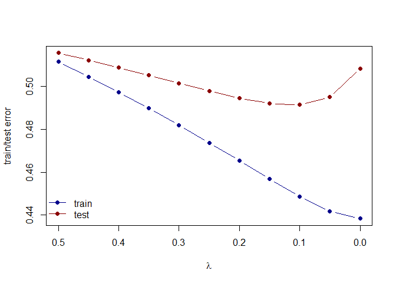
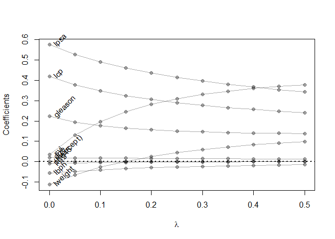

Homework 3
================
Jingyuan Wu
2/9/2022

# Instruction

Using the RMarkdown/knitr/github mechanism, implement the following
tasks:

Use the prostate cancer data.

Use the cor function to reproduce the correlations listed in HTF Table
3.1, page 50.

Treat lcavol as the outcome, and use all other variables in the data set
as predictors.

With the training subset of the prostate data, train a least-squares
regression model with all predictors using the lm function.

Use the testing subset to compute the test error (average squared-error
loss) using the fitted least-squares regression model.

Train a ridge regression model using the glmnet function, and tune the
value of lambda (i.e., use guess and check to find the value of lambda
that approximately minimizes the test error).

Create a figure that shows the training and test error associated with
ridge regression as a function of lambda

Create a path diagram of the ridge regression analysis, similar to HTF
Figure 3.8

``` r
library(dplyr)
library(glmnet)
prostate <- 
  read.table(url(
    'https://web.stanford.edu/~hastie/ElemStatLearn/datasets/prostate.data'))
```

``` r
## generate the correlations
cor(prostate)
```

    ##              lcavol      lweight       age         lbph         svi
    ## lcavol   1.00000000  0.280521380 0.2249999  0.027349703  0.53884500
    ## lweight  0.28052138  1.000000000 0.3479691  0.442264399  0.15538490
    ## age      0.22499988  0.347969112 1.0000000  0.350185896  0.11765804
    ## lbph     0.02734970  0.442264399 0.3501859  1.000000000 -0.08584324
    ## svi      0.53884500  0.155384903 0.1176580 -0.085843238  1.00000000
    ## lcp      0.67531048  0.164537142 0.1276678 -0.006999431  0.67311118
    ## gleason  0.43241706  0.056882093 0.2688916  0.077820447  0.32041222
    ## pgg45    0.43365225  0.107353785 0.2761124  0.078460018  0.45764762
    ## lpsa     0.73446033  0.433319382 0.1695928  0.179809404  0.56621822
    ## train   -0.04654347 -0.009940658 0.1776155 -0.029939957  0.02679950
    ##                  lcp     gleason      pgg45        lpsa        train
    ## lcavol   0.675310484  0.43241706 0.43365225  0.73446033 -0.046543468
    ## lweight  0.164537142  0.05688209 0.10735379  0.43331938 -0.009940658
    ## age      0.127667752  0.26889160 0.27611245  0.16959284  0.177615517
    ## lbph    -0.006999431  0.07782045 0.07846002  0.17980940 -0.029939957
    ## svi      0.673111185  0.32041222 0.45764762  0.56621822  0.026799505
    ## lcp      1.000000000  0.51483006 0.63152825  0.54881317 -0.037427296
    ## gleason  0.514830063  1.00000000 0.75190451  0.36898681 -0.044171456
    ## pgg45    0.631528246  0.75190451 1.00000000  0.42231586  0.100516371
    ## lpsa     0.548813175  0.36898681 0.42231586  1.00000000 -0.033889743
    ## train   -0.037427296 -0.04417146 0.10051637 -0.03388974  1.000000000

``` r
prostate_train <- prostate %>%
  filter(train == TRUE) %>% 
  select(-train)
prostate_test <- prostate %>%
  filter(train == FALSE) %>% 
  select(-train)

## train a least-squares regression model with all predictors
fit <- lm(lcavol ~ ., data=prostate_train)

## L2 loss function
L2_loss <- function(y, yhat)
  (y-yhat)^2

## function to compute testing/training error with least-squares regression model
error <- function(dat, fit, loss=L2_loss)
  mean(loss(dat$lcavol, predict(fit, newdata=dat)))

## compute test error (average squared-error loss) using the fitted least-squares regression model
error(prostate_test, fit)
```

    ## [1] 0.5084068

``` r
## train a ridge regression
form  <- lcavol ~  lweight + age + lbph + lcp + pgg45 + lpsa + svi + gleason
x_inp <- model.matrix(form, data=prostate_train)
y_out <- prostate_train$lcavol

fit <- glmnet(x=x_inp, y=y_out, alpha=0, lambda=seq(0.5, 0, -0.05))
#print(fit$beta)

## functions to compute testing/training error with glmnet
error <- function(dat, fit, lam, form, loss=L2_loss) {
  x_inp <- model.matrix(form, data=dat)
  y_out <- dat$lcavol
  y_hat <- predict(fit, newx=x_inp, s=lam)  ## see predict.elnet
  mean(loss(y_out, y_hat))
}

## function to find lambda with least test error
find_lambda <- function(dat) {
  test_error_min=1000000
  for (i in dat){
    test_error=error(prostate_test, fit, lam=i, form=form)
    if (test_error_min>test_error){
      test_error_min=test_error
      l=i
    }
  }
  print(l)
}

find_lambda(seq(0.5, 0, -0.01))
```

    ## [1] 0.12

We can find the value of lambda that approximately minimizes the test
error is about 0.12.

``` r
## testing error at lambda=0.12
error(prostate_test, fit, lam=0.12, form=form)
```

    ## [1] 0.4911847

``` r
## compute training and testing errors as function of lambda
err_train_1 <- sapply(fit$lambda, function(lam) 
  error(prostate_train, fit, lam, form))
err_test_1 <- sapply(fit$lambda, function(lam) 
  error(prostate_test, fit, lam, form))

## plot the training and test error associated with the ridge regression as a function of lambda
plot(x=range(fit$lambda),
     y=range(c(err_train_1, err_test_1)),
     xlim=rev(range(fit$lambda)),
     type='n',
     xlab=expression(lambda),
     ylab='train/test error')
points(fit$lambda, err_train_1, pch=19, type='b', col='darkblue')
points(fit$lambda, err_test_1, pch=19, type='b', col='darkred')
legend('bottomleft', c('train','test'), lty=1, pch=19,
       col=c('darkblue','darkred'), bty='n')
```

<!-- -->

``` r
#colnames(fit$beta) <- paste('lam =', fit$lambda)
#print(fit$beta %>% as.matrix)

## plot path diagram of the ridge regression analysis
plot(x=range(fit$lambda),
     y=range(as.matrix(fit$beta)),
     type='n',
     xlab=expression(lambda),
     ylab='Coefficients')
for(i in 1:nrow(fit$beta)) {
  points(x=fit$lambda, y=fit$beta[i,], pch=19, col='#00000055')
  lines(x=fit$lambda, y=fit$beta[i,], col='#00000055')
}
text(x=0, y=fit$beta[,ncol(fit$beta)], 
     labels=rownames(fit$beta),
     xpd=NA, pos=4, srt=45)
abline(h=0, lty=3, lwd=2)
```

<!-- -->
