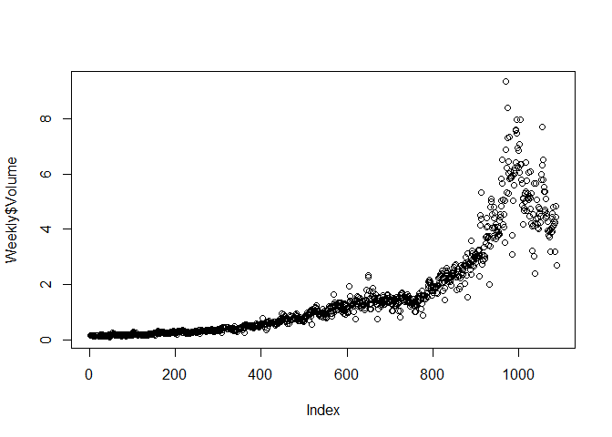

Homework 4
================
Jingyuan Wu
2/16/2022

# Instructions

Using the RMarkdown/knitr/github mechanism, complete the following
exercises from chapter 4, section 4.7 (beginning pp 168) or the
<https://www.statlearning.com/>:

Exercise 4: “When the number of features p is large, there tends to be a
deterioration in the performance of KNN and other local approaches that
perform prediction using only observations…” Please type your solutions
within your R Markdown document. No R coding is required for this
exercise.

Exercise 10: “This question should be answered using the Weekly data
set, which is part of the ISLR package. This data is similar…” This
exercise requires R coding.

# Solution

Exercise 4:

1.  Suppose that we have a set of observations, each with measurements
    on p = 1 feature, X. We assume that X is uniformly (evenly)
    distributed on \[0, 1\]. Associated with each observation is a
    response value. Suppose that we wish to predict a test observation’s
    response using only observations that are within 10 % of the range
    of X closest to that test observation. For instance, in order to
    predict the response for a test observation with X = 0.6, we will
    use observations in the range \[0.55, 0.65\]. On average, what
    fraction of the available observations will we use to make the
    prediction?

-   When *x* ∈ \[0.05, 0.95\], we will use observations in the range
    \[*x* + 0.05, *x* − 0.05\]. It means 10% of the available
    observations will be used for making the prediction. When
    *x* &lt; 0.05, we will take \[0, *x* + 0.05\], which represents
    (100*x* + 5). When *x* &gt; 0.95, we will take \[*x* − 0.05, 1\],
    which represents (105 − 100*x*). On average, it is
    ∫<sub>0.05</sub><sup>0.95</sup>10*d**x* + ∫<sub>0</sub><sup>0.05</sup>(100*x* + 5)*d**x* + ∫<sub>0.95</sub><sup>1</sup>(105 − 100)*d**x* = 9.75.
    In conclusion, the average fraction of the available observations we
    will use to make the prediction is 9.75%.

2.  Now suppose that we have a set of observations, each with
    measurements on p = 2 features, X1 and X2. We assume that (X1, X2)
    are uniformly distributed on \[0, 1\] × \[0, 1\]. We wish to predict
    a test observation’s response using only observations that are
    within 10 % of the range of X1 and within 10 % of the range of X2
    closest to that test observation. For instance, in order to predict
    the response for a test observation with X1 = 0.6 and X2 = 0.35, we
    will use observations in the range \[0.55, 0.65\] for X1 and in the
    range \[0.3, 0.9\] for X2. On average, what fraction of the
    available observations will we use to make the prediction?

-   Assume *X*1 and *X*2 are independent, the fraction will be
    9.75% × 9.75% = 0.950625%.

3.  Now suppose that we have a set of observations on p = 100 features.
    Again the observations are uniformly distributed on each feature,
    and again each feature ranges in value from 0 to 1. We wish to
    predict a test observation’s response using observations within the
    10 % of each feature’s range that is closest to that test
    observation. What fraction of the available observations will we use
    to make the prediction?

-   It can be 9.75%<sup>100</sup>.

4.  Using your answers to parts (a)–(c), argue that a drawback of KNN
    when p is large is that there are very few training observations
    “near” any given test observation.

-   Based on question a-c, the fraction of available observations we
    will use to make the prediction is 9.75%<sup>*p*</sup>. As p is
    large, we assume that
    lim<sub>*p* →  + ∞</sub>9.75%<sup>*p*</sup> = 0.

5.  Now suppose that we wish to make a prediction for a test observation
    by creating a p-dimensional hypercube centered around the test
    observation that contains, on average, 10 % of the training
    observations. For p = 1, 2, and 100, what is the length of each side
    of the hypercube? Comment on your answer.

-   When p=1, l=0.1, when p=2, l=0.1<sup>1/2</sup>, when p=100,
    l=0.1<sup>1/100</sup>.

Exercise 10:

This question should be answered using the Weekly data set, which is
part of the ISLR2 package. This data is similar in nature to the Smarket
data from this chapter’s lab, except that it contains 1,089 weekly
returns for 21 years, from the beginning of 1990 to the end of 2010.

1.  Produce some numerical and graphical summaries of the Weekly data.
    Do there appear to be any patterns?

``` r
library(ISLR)
library(tidyverse)
library(Hmisc)
summary(Weekly)
```

    ##       Year           Lag1               Lag2               Lag3         
    ##  Min.   :1990   Min.   :-18.1950   Min.   :-18.1950   Min.   :-18.1950  
    ##  1st Qu.:1995   1st Qu.: -1.1540   1st Qu.: -1.1540   1st Qu.: -1.1580  
    ##  Median :2000   Median :  0.2410   Median :  0.2410   Median :  0.2410  
    ##  Mean   :2000   Mean   :  0.1506   Mean   :  0.1511   Mean   :  0.1472  
    ##  3rd Qu.:2005   3rd Qu.:  1.4050   3rd Qu.:  1.4090   3rd Qu.:  1.4090  
    ##  Max.   :2010   Max.   : 12.0260   Max.   : 12.0260   Max.   : 12.0260  
    ##       Lag4               Lag5              Volume            Today         
    ##  Min.   :-18.1950   Min.   :-18.1950   Min.   :0.08747   Min.   :-18.1950  
    ##  1st Qu.: -1.1580   1st Qu.: -1.1660   1st Qu.:0.33202   1st Qu.: -1.1540  
    ##  Median :  0.2380   Median :  0.2340   Median :1.00268   Median :  0.2410  
    ##  Mean   :  0.1458   Mean   :  0.1399   Mean   :1.57462   Mean   :  0.1499  
    ##  3rd Qu.:  1.4090   3rd Qu.:  1.4050   3rd Qu.:2.05373   3rd Qu.:  1.4050  
    ##  Max.   : 12.0260   Max.   : 12.0260   Max.   :9.32821   Max.   : 12.0260  
    ##  Direction 
    ##  Down:484  
    ##  Up  :605  
    ##            
    ##            
    ##            
    ## 

``` r
dim(Weekly)
```

    ## [1] 1089    9

``` r
rcorr(as.matrix(Weekly[,1:8]))
```

    ##         Year  Lag1  Lag2  Lag3  Lag4  Lag5 Volume Today
    ## Year    1.00 -0.03 -0.03 -0.03 -0.03 -0.03   0.84 -0.03
    ## Lag1   -0.03  1.00 -0.07  0.06 -0.07 -0.01  -0.06 -0.08
    ## Lag2   -0.03 -0.07  1.00 -0.08  0.06 -0.07  -0.09  0.06
    ## Lag3   -0.03  0.06 -0.08  1.00 -0.08  0.06  -0.07 -0.07
    ## Lag4   -0.03 -0.07  0.06 -0.08  1.00 -0.08  -0.06 -0.01
    ## Lag5   -0.03 -0.01 -0.07  0.06 -0.08  1.00  -0.06  0.01
    ## Volume  0.84 -0.06 -0.09 -0.07 -0.06 -0.06   1.00 -0.03
    ## Today  -0.03 -0.08  0.06 -0.07 -0.01  0.01  -0.03  1.00
    ## 
    ## n= 1089 
    ## 
    ## 
    ## P
    ##        Year   Lag1   Lag2   Lag3   Lag4   Lag5   Volume Today 
    ## Year          0.2871 0.2709 0.3225 0.3048 0.3143 0.0000 0.2845
    ## Lag1   0.2871        0.0135 0.0531 0.0187 0.7874 0.0321 0.0133
    ## Lag2   0.2709 0.0135        0.0124 0.0541 0.0167 0.0047 0.0509
    ## Lag3   0.3225 0.0531 0.0124        0.0128 0.0454 0.0222 0.0187
    ## Lag4   0.3048 0.0187 0.0541 0.0128        0.0125 0.0439 0.7964
    ## Lag5   0.3143 0.7874 0.0167 0.0454 0.0125        0.0535 0.7166
    ## Volume 0.0000 0.0321 0.0047 0.0222 0.0439 0.0535        0.2754
    ## Today  0.2845 0.0133 0.0509 0.0187 0.7964 0.7166 0.2754

``` r
plot(Weekly$Volume)
```

<!-- -->

-   After checking the correlation of numerical variables, I find that
    only the volume (the relationship between volume and year) can be
    valuable in graphical summaries. Therefore, I create a scatter plot
    to show the patter of the volume. We can see that when time passed,
    the volume increased.

2.  Use the full data set to perform a logistic regression with
    Direction as the response and the five lag variables plus Volume as
    predictors. Use the summary function to print the results. Do any of
    the predictors appear to be statistically significant? If so, which
    ones?

``` r
fit.glm <- glm(Direction ~ Lag1 + Lag2 + Lag3 + Lag4 + Lag5 + Volume, data = Weekly, family = binomial)
summary(fit.glm)
```

    ## 
    ## Call:
    ## glm(formula = Direction ~ Lag1 + Lag2 + Lag3 + Lag4 + Lag5 + 
    ##     Volume, family = binomial, data = Weekly)
    ## 
    ## Deviance Residuals: 
    ##     Min       1Q   Median       3Q      Max  
    ## -1.6949  -1.2565   0.9913   1.0849   1.4579  
    ## 
    ## Coefficients:
    ##             Estimate Std. Error z value Pr(>|z|)   
    ## (Intercept)  0.26686    0.08593   3.106   0.0019 **
    ## Lag1        -0.04127    0.02641  -1.563   0.1181   
    ## Lag2         0.05844    0.02686   2.175   0.0296 * 
    ## Lag3        -0.01606    0.02666  -0.602   0.5469   
    ## Lag4        -0.02779    0.02646  -1.050   0.2937   
    ## Lag5        -0.01447    0.02638  -0.549   0.5833   
    ## Volume      -0.02274    0.03690  -0.616   0.5377   
    ## ---
    ## Signif. codes:  0 '***' 0.001 '**' 0.01 '*' 0.05 '.' 0.1 ' ' 1
    ## 
    ## (Dispersion parameter for binomial family taken to be 1)
    ## 
    ##     Null deviance: 1496.2  on 1088  degrees of freedom
    ## Residual deviance: 1486.4  on 1082  degrees of freedom
    ## AIC: 1500.4
    ## 
    ## Number of Fisher Scoring iterations: 4

-   We can see that Lag2 is statistically significant since its p value
    is the only one greater than 0.05.

3.  Compute the confusion matrix and overall fraction of correct
    predictions. Explain what the confusion matrix is telling you about
    the types of mistakes made by logistic regression.

``` r
probs <- predict(fit.glm, type = "response")
pred.glm <- rep(NA, length(Weekly$Direction))
pred.glm[probs <= 0.5] = "Down"
pred.glm[probs > 0.5] = "Up"
confusion_matrix=table(pred.glm, Weekly$Direction)
confusion_matrix
```

    ##         
    ## pred.glm Down  Up
    ##     Down   54  48
    ##     Up    430 557

``` r
accuracy=(confusion_matrix[1,1]+confusion_matrix[2,2])/length(Weekly$Direction)
print(paste("accuracy:", accuracy))
```

    ## [1] "accuracy: 0.561065197428834"

``` r
training_error_rate=(confusion_matrix[2,1]+confusion_matrix[1,2])/length(Weekly$Direction)
print(paste("training error rate:", training_error_rate))
```

    ## [1] "training error rate: 0.438934802571166"

``` r
precision=confusion_matrix[1,1]/(confusion_matrix[1,1]+confusion_matrix[2,2])
print(paste("precision:", precision))
```

    ## [1] "precision: 0.088379705400982"

``` r
recall=confusion_matrix[1,1]/(confusion_matrix[1,1]+confusion_matrix[1,2])
print(paste("recall:", recall))
```

    ## [1] "recall: 0.529411764705882"

``` r
F1_score=2*precision*recall/(precision+recall)
print(paste("F1 score:", F1_score))
```

    ## [1] "F1 score: 0.151472650771389"

-   We can see in the confusion matrix that there are 59 samples in Down
    and 557 samples in Up are correctly predicted. 930 Up samples are
    mistakenly predicted to be Down. 98 Down samples are mistakenly
    predicted to be Up.

4.  Now fit the logistic regression model using a training data period
    from 1990 to 2008, with Lag2 as the only predictor. Compute the
    confusion matrix and the overall fraction of correct predictions for
    the held out data (that is, the data from 2009 and 2010).

``` r
train <- Weekly %>% filter(1990<=Year & Year<=2008)
test <- Weekly %>% filter(2009<=Year & Year<=2010)
fit.glm2 <- glm(Direction ~ Lag2, data = train, family = binomial)
#summary(fit.glm2)
probs2 <- predict(fit.glm2, test, type = "response")
pred.glm2 <- rep(NA, length(test$Direction))
pred.glm2[probs2 <= 0.5] = "Down"
pred.glm2[probs2 > 0.5] = "Up"
confusion_matrix2=table(pred.glm2, test$Direction)
confusion_matrix2
```

    ##          
    ## pred.glm2 Down Up
    ##      Down    9  5
    ##      Up     34 56

``` r
accuracy2=(confusion_matrix2[1,1]+confusion_matrix2[2,2])/length(test$Direction)
print(paste("accuracy:", accuracy2))
```

    ## [1] "accuracy: 0.625"

5.  Repeat (d) using LDA.

``` r
library(MASS)
fit.lda <- lda(Direction ~ Lag2, data = train, family = binomial)
#fit.lda
pred.lda <- predict(fit.lda, test, type = "response")
confusion_matrix3=table(pred.lda$class, test$Direction)
confusion_matrix3
```

    ##       
    ##        Down Up
    ##   Down    9  5
    ##   Up     34 56

``` r
accuracy3=(confusion_matrix3[1,1]+confusion_matrix3[2,2])/length(test$Direction)
print(paste("accuracy:", accuracy3))
```

    ## [1] "accuracy: 0.625"

6.  Repeat (d) using QDA.

``` r
fit.qda <- qda(Direction ~ Lag2, data = train, family = binomial)
pred.qda <- predict(fit.qda, test, type = "response")
confusion_matrix4=table(pred.qda$class, test$Direction)
confusion_matrix4
```

    ##       
    ##        Down Up
    ##   Down    0  0
    ##   Up     43 61

``` r
accuracy4=(confusion_matrix4[1,1]+confusion_matrix4[2,2])/length(test$Direction)
print(paste("accuracy:", accuracy4))
```

    ## [1] "accuracy: 0.586538461538462"

7.  Repeat (d) using KNN with K = 1.

``` r
library(class)
train.X <- as.matrix(train$Lag2)
test.X <- as.matrix(test$Lag2)
train.y <- train$Direction
set.seed(1234)
pred.knn <- knn(train.X, test.X, train.y, k = 1)
confusion_matrix5=table(pred.knn, test$Direction)
confusion_matrix5
```

    ##         
    ## pred.knn Down Up
    ##     Down   21 29
    ##     Up     22 32

``` r
accuracy5=(confusion_matrix5[1,1]+confusion_matrix5[2,2])/length(test$Direction)
print(paste("accuracy:", accuracy5))
```

    ## [1] "accuracy: 0.509615384615385"

8.  Repeat (d) using naive Bayes.

``` r
library(e1071)
fit.naiveBayes <- naiveBayes(Direction ~ Lag2, data = train)
#fit.naiveBayes
pred.naiveBayes <- predict(fit.naiveBayes, test)
confusion_matrix6=table(pred.naiveBayes, test$Direction)
confusion_matrix6
```

    ##                
    ## pred.naiveBayes Down Up
    ##            Down    0  0
    ##            Up     43 61

``` r
accuracy6=(confusion_matrix6[1,1]+confusion_matrix6[2,2])/length(test$Direction)
print(paste("accuracy:", accuracy6))
```

    ## [1] "accuracy: 0.586538461538462"

1.  Which of these methods appears to provide the best results on this
    data?

-   By comparing the accuracy, we can see that the accuracy scores of
    those models are LDA = Logistic Regression &gt; QDA = Naive
    Bayes &gt; KNN. We can conclude that LDA and logistic regression
    appears to provide the best results on this data.

10. Experiment with different combinations of predictors, including
    possible transformations and interactions, for each of the methods.
    Report the variables, method, and associated confusion matrix that
    appears to provide the best results on the held out data. Note that
    you should also experiment with values for K in the KNN classifier.

``` r
# logistic regression with Lag2:Lag1
fit.glm7 <- glm(Direction ~ Lag2:Lag1, data = train, family = binomial)
probs7 <- predict(fit.glm7, test, type = "response")
pred.glm7 <- rep(NA, length(test$Direction))
pred.glm7[probs7 <= 0.5] = "Down"
pred.glm7[probs7 > 0.5] = "Up"
confusion_matrix7=table(pred.glm7, test$Direction)
confusion_matrix7
```

    ##          
    ## pred.glm7 Down Up
    ##      Down    1  1
    ##      Up     42 60

``` r
accuracy7=(confusion_matrix7[1,1]+confusion_matrix7[2,2])/length(test$Direction)
print(paste("accuracy:", accuracy7))
```

    ## [1] "accuracy: 0.586538461538462"

``` r
# LDA with Lag2:Lag1
fit.lda8 <- lda(Direction ~ Lag2:Lag1, data = train, family = binomial)
pred.lda8 <- predict(fit.lda8, test, type = "response")
confusion_matrix8=table(pred.lda8$class, test$Direction)
confusion_matrix8
```

    ##       
    ##        Down Up
    ##   Down    0  1
    ##   Up     43 60

``` r
accuracy8=(confusion_matrix8[1,1]+confusion_matrix8[2,2])/length(test$Direction)
print(paste("accuracy:", accuracy8))
```

    ## [1] "accuracy: 0.576923076923077"

``` r
# QDA with sqrt(abs(Lag2))
fit.qda9 <- qda(Direction ~ Lag2+sqrt(abs(Lag2)), data = train, family = binomial)
pred.qda9 <- predict(fit.qda9, test, type = "response")
confusion_matrix9=table(pred.qda9$class, test$Direction)
confusion_matrix9
```

    ##       
    ##        Down Up
    ##   Down   12 13
    ##   Up     31 48

``` r
accuracy9=(confusion_matrix9[1,1]+confusion_matrix9[2,2])/length(test$Direction)
print(paste("accuracy:", accuracy9))
```

    ## [1] "accuracy: 0.576923076923077"

``` r
# KNN with k = 10
set.seed(1234)
pred.knn10 <- knn(train.X, test.X, train.y, k = 10)
confusion_matrix10=table(pred.knn10, test$Direction)
confusion_matrix10
```

    ##           
    ## pred.knn10 Down Up
    ##       Down   19 21
    ##       Up     24 40

``` r
accuracy10=(confusion_matrix10[1,1]+confusion_matrix10[2,2])/length(test$Direction)
print(paste("accuracy:", accuracy10))
```

    ## [1] "accuracy: 0.567307692307692"

``` r
# KNN with k = 100
set.seed(1234)
pred.knn100 <- knn(train.X, test.X, train.y, k = 100)
confusion_matrix100=table(pred.knn100, test$Direction)
confusion_matrix100
```

    ##            
    ## pred.knn100 Down Up
    ##        Down   10 12
    ##        Up     33 49

``` r
accuracy100=(confusion_matrix100[1,1]+confusion_matrix100[2,2])/length(test$Direction)
print(paste("accuracy:", accuracy100))
```

    ## [1] "accuracy: 0.567307692307692"

``` r
# Naive Bayes with sqrt(abs(Lag2))
fit.naiveBayes11 <- naiveBayes(Direction ~ Lag2+sqrt(abs(Lag2)), data = train)
pred.naiveBayes11 <- predict(fit.naiveBayes11, test)
confusion_matrix11=table(pred.naiveBayes11, test$Direction)
confusion_matrix11
```

    ##                  
    ## pred.naiveBayes11 Down Up
    ##              Down    0  0
    ##              Up     43 61

``` r
accuracy11=(confusion_matrix11[1,1]+confusion_matrix11[2,2])/length(test$Direction)
print(paste("accuracy:", accuracy11))
```

    ## [1] "accuracy: 0.586538461538462"
