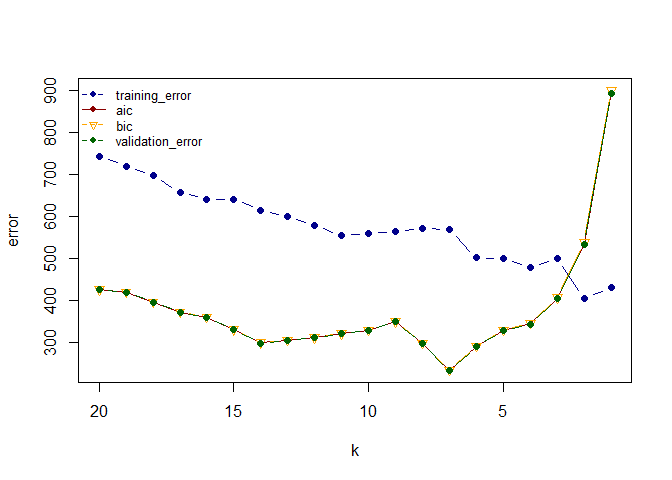

Homework 5
================
Jingyuan Wu
2/27/2022

# Instructions

Goal: Understand and implement various ways to approximate test error.

In the ISLR book, read section 6.1.3 “Choosing the Optimal Model” and
section 5.1 “Cross-Validation”. Extend and convert the attached
effective-df-aic-bic-mcycle.R R script into an R markdown file that
accomplishes the following tasks.

Randomly split the mcycle data into training (75%) and validation (25%)
subsets.

Using the mcycle data, consider predicting the mean acceleration as a
function of time. Use the Nadaraya-Watson method with the k-NN kernel
function to create a series of prediction models by varying the tuning
parameter over a sequence of values. (hint: the script already
implements this)

With the squared-error loss function, compute and plot the training
error, AIC, BIC, and validation error (using the validation data) as
functions of the tuning parameter.

For each value of the tuning parameter, Perform 5-fold cross-validation
using the combined training and validation data. This results in 5
estimates of test error per tuning parameter value.

Plot the CV-estimated test error (average of the five estimates from
each fold) as a function of the tuning parameter. Add vertical line
segments to the figure (using the segments function in R) that represent
one “standard error” of the CV-estimated test error (standard deviation
of the five estimates from each fold).

Interpret the resulting figures and select a suitable value for the
tuning parameter.

``` r
library('MASS') ## for 'mcycle'
library('manipulate') ## for 'manipulate'
library(caret) ## for k-fold

mcycle=mcycle

# split training and validation set
set.seed(1234)
index=sort(sample(nrow(mcycle), round(nrow(mcycle)*0.75),0))
train=mcycle[index,]
val=mcycle[-index,]
X_train=matrix(train[,1], length(train[,1]), 1)
X_val=matrix(val[,1], length(val[,1]), 1)
y_train=train[,2]
y_val=val[,2]
```

``` r
y <- mcycle$accel
x <- mcycle$times

## k-NN kernel function
## x  - n x p matrix of training inputs
## x0 - 1 x p input where to make prediction
## k  - number of nearest neighbors
kernel_k_nearest_neighbors <- function(x, x0, k) {
  ## compute distance between each x and x0
  z <- t(t(x) - x0)
  d <- sqrt(rowSums(z*z))

  ## initialize kernel weights to zero
  w <- rep(0, length(d))
  
  ## set weight to 1 for k nearest neighbors
  w[order(d)[1:k]] <- 1
  
  return(w)
}

## Make predictions using the NW method
## y  - n x 1 vector of training outputs
## x  - n x p matrix of training inputs
## x0 - m x p matrix where to make predictions
## kern  - kernel function to use
## ... - arguments to pass to kernel function
nadaraya_watson <- function(y, x, x0, kern, ...) {
  k <- t(apply(x0, 1, function(x0_) {
    k_ <- kern(x, x0_, ...)
    k_/sum(k_)
  }))
  yhat <- drop(k %*% y)
  attr(yhat, 'k') <- k
  return(yhat)
}

## create a grid of inputs 
x_plot <- matrix(seq(min(x),max(x),length.out=100),100,1)

## make predictions using NW method for k=1, k=10 and k=20
y_hat_plot_1 <- nadaraya_watson(y, x, x_plot, kern=kernel_k_nearest_neighbors, k=1)
y_hat_plot_10 <- nadaraya_watson(y, x, x_plot, kern=kernel_k_nearest_neighbors, k=10)
y_hat_plot_20 <- nadaraya_watson(y, x, x_plot, kern=kernel_k_nearest_neighbors, k=20)

## plot predictions
plot(x, y, xlab="Time (ms)", ylab="Acceleration (g)")
lines(x_plot, y_hat_plot_1, col="darkblue", lwd=2) 
lines(x_plot, y_hat_plot_10, col="darkred", lwd=2) 
lines(x_plot, y_hat_plot_20, col="darkgreen", lwd=2) 
legend('bottomright', c('k=1', 'k=10', 'k=20'), cex=0.8, col=c('darkblue', 'darkred', 'darkgreen'), bty='n', lty=1)
```

<!-- -->

``` r
# print yhat by varying the tuning parameter over a sequence of values
y_train_hat=vector()
k=1:20
for (i in k){
output=nadaraya_watson(y_train, X_train, X_train, kern=kernel_k_nearest_neighbors, i)
y_train_hat=c(y_train_hat, output)
}

y_val_hat=vector()
for (i in k){
output=nadaraya_watson(y_train, X_train, X_val, kern=kernel_k_nearest_neighbors, i)
y_val_hat=c(y_val_hat, output)
}

y_train_hat=matrix(y_train_hat, length(y_train), length(k))
colnames(y_train_hat)=paste0("k=", k)

y_val_hat=matrix(y_val_hat, length(y_val), length(k))
colnames(y_val_hat)=paste0("k=", k)

## Compute effective df using NW method
## y  - n x 1 vector of training outputs
## x  - n x p matrix of training inputs
## kern  - kernel function to use
## ... - arguments to pass to kernel function
effective_df <- function(y, x, kern, ...) {
  y_hat <- nadaraya_watson(y, x, x,
    kern=kern, ...)
  sum(diag(attr(y_hat, 'k')))
}

## compute effective degrees of freedom
edf=vector()
for (i in k){
output=effective_df(y_train, X_train, kern=kernel_k_nearest_neighbors, i)
edf=c(edf, output)
}

## loss function
## y    - train/test y
## yhat - predictions at train/test x
loss_squared_error <- function(y, yhat)
  (y - yhat)^2

## test/train error
## y    - train/test y
## yhat - predictions at train/test x
## loss - loss function
error <- function(y, yhat, loss=loss_squared_error)
  mean(loss(y, yhat))

## AIC
## y    - training y
## yhat - predictions at training x
## d    - effective degrees of freedom
aic <- function(y, yhat, d)
  error(y, yhat) + 2/length(y)*d

## BIC
## y    - training y
## yhat - predictions at training x
## d    - effective degrees of freedom
bic <- function(y, yhat, d)
  error(y, yhat) + log(length(y))/length(y)*d

training_error=vector()
for (i in k){
  output=error(y_train, y_train_hat[,paste0("k=",i)])
  training_error=c(training_error, output)
}

aic_=vector()
for (i in 1:length(k)){
  output=aic(y_val, y_val_hat[,paste0("k=",k[i])], edf[i])
  aic_=c(aic_, output)
}

bic_=vector()
for (i in 1:length(k)){
  output=bic(y_val, y_val_hat[,paste0("k=",k[i])], edf[i])
  bic_=c(bic_, output)
}

validation_error=vector()
for (i in k){
  output=error(y_val, y_val_hat[,paste0("k=",i)])
  validation_error=c(validation_error, output)
}

## plot training error, aic, bic and validation error
plot(x=range(k),
     y=range(c(training_error, aic_, bic_, validation_error)),
     xlim=rev(range(k)),
     type='n',
     xlab='k',
     ylab='error')
points(k, training_error, pch=19, type='b', col='darkblue')
points(k, aic_, pch=19, type='l', col='darkred')
points(k, bic_, pch=25, type='b', col='orange')
points(k, validation_error, pch=19, type='b', col='darkgreen')
legend('topleft', c('training_error', 'aic', 'bic', 'validation_error'), pch=c(19,19,25,19), cex=0.8, col=c('darkblue', 'darkred', 'orange', 'darkgreen'), bty='n', lty=c(2,1,2,2))
```

<!-- -->

``` r
## create folds
set.seed(1)
folds <-createMultiFolds(y=mcycle$accel,k=5)

## perform 5-fold cross-validation
output=vector()
for (j in k){
  for(i in 1:5){  
    fold_test <- mcycle[folds[[i]],]
    fold_train <- mcycle[-folds[[i]],]
    fold_predict <- nadaraya_watson(fold_train$accel, as.matrix(fold_train$times), as.matrix(fold_test$times), kern=kernel_k_nearest_neighbors, j)
    result=error(fold_test$accel, fold_predict)
    output=c(output, result)
  }
}  
test_error=matrix(output, 5, length(k))
colnames(test_error)=paste0("k=", k)
```

``` r
## calculate average test error of the five estimates from each fold
avg_test_error=data.frame(k, array(colMeans(test_error)))
## calculate standard deviation of the five estimates from each fold
standard_error=array(apply(test_error, 2, sd))

## plot with segments
plot(avg_test_error, pch=19, ylab='CV-estimated test error', ylim=c(0,max(avg_test_error)+max(standard_error[i])))
for (i in 1:length(k)){
  segments(x0=avg_test_error[i,1], x1=avg_test_error[i,1], y0=avg_test_error[i,2]+standard_error[i], y1=avg_test_error[i,2]-standard_error[i], lwd = 2)
}
```

<!-- -->

From the plot above, we can see that the larger the k is, the error
first goes down and then goes up and the sd becomes smaller. The
selection of k will be a bias-variance tradeoff because when the larger
k is, the larger the bias is and the smaller the sd is. When k is
larger, the model will be more complex and it will be less sensitive to
the noise. Therefore, for this problem, we can choose 3 for k. When k=3,
the model has a pair of relatively small average test error and sd.
