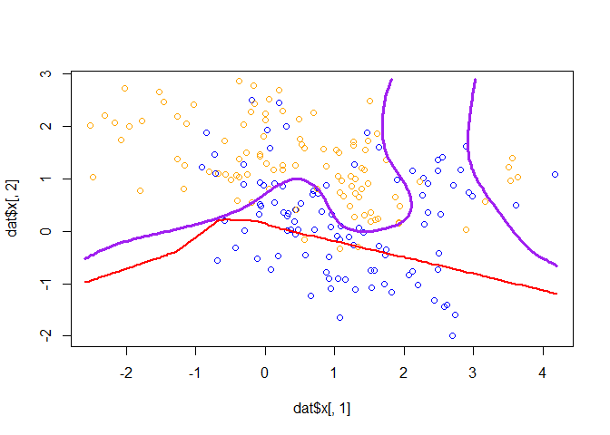
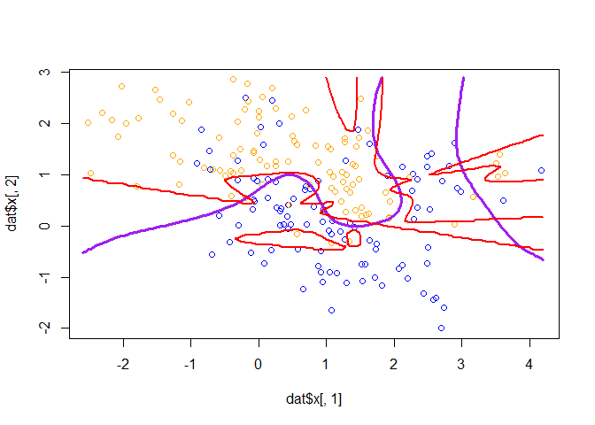

Homework 7
================
Jingyuan Wu
4/12/2022

Goal: Get started using Keras to construct simple neural networks Work
through the “Image Classification” tutorial on the RStudio Keras
website.

-   Use the Keras library to re-implement the simple neural network
    discussed during lecture for the mixture data (see nnet.R). Use a
    single 10-node hidden layer; fully connected.

-   Create a figure to illustrate that the predictions are (or are not)
    similar using the ‘nnet’ function versus the Keras model.

-   (optional extra credit) Convert the neural network described in the
    “Image Classification” tutorial to a network that is similar to one
    of the convolutional networks described during lecture on 4/15
    (i.e., Net-3, Net-4, or Net-5) and also described in the ESL book
    section 11.7. See the !ConvNet tutorial on the RStudio Keras
    website.

``` r
library(keras)
```

``` r
fashion_mnist <- dataset_fashion_mnist()

c(train_images, train_labels) %<-% fashion_mnist$train
c(test_images, test_labels) %<-% fashion_mnist$test
```

``` r
class_names = c('T-shirt/top',
                'Trouser',
                'Pullover',
                'Dress',
                'Coat', 
                'Sandal',
                'Shirt',
                'Sneaker',
                'Bag',
                'Ankle boot')
```

``` r
dim(train_images)
```

    ## [1] 60000    28    28

``` r
dim(train_labels)
```

    ## [1] 60000

``` r
train_labels[1:20]
```

    ##  [1] 9 0 0 3 0 2 7 2 5 5 0 9 5 5 7 9 1 0 6 4

``` r
dim(test_images)
```

    ## [1] 10000    28    28

``` r
dim(test_labels)
```

    ## [1] 10000

``` r
library(tidyr)
library(ggplot2)

image_1 <- as.data.frame(train_images[1, , ])
colnames(image_1) <- seq_len(ncol(image_1))
image_1$y <- seq_len(nrow(image_1))
image_1 <- gather(image_1, "x", "value", -y)
image_1$x <- as.integer(image_1$x)

ggplot(image_1, aes(x = x, y = y, fill = value)) +
  geom_tile() +
  scale_fill_gradient(low = "white", high = "black", na.value = NA) +
  scale_y_reverse() +
  theme_minimal() +
  theme(panel.grid = element_blank())   +
  theme(aspect.ratio = 1) +
  xlab("") +
  ylab("")
```

<!-- -->

``` r
train_images <- train_images / 255
test_images <- test_images / 255
```

``` r
par(mfcol=c(5,5))
par(mar=c(0, 0, 1.5, 0), xaxs='i', yaxs='i')
for (i in 1:25) { 
  img <- train_images[i, , ]
  img <- t(apply(img, 2, rev)) 
  image(1:28, 1:28, img, col = gray((0:255)/255), xaxt = 'n', yaxt = 'n',
        main = paste(class_names[train_labels[i] + 1]))
}
```

<!-- -->

``` r
model <- keras_model_sequential()
model %>%
  layer_flatten(input_shape = c(28, 28)) %>%
  layer_dense(units = 128, activation = 'relu') %>%
  layer_dense(units = 10, activation = 'softmax')
```

``` r
model %>% compile(
  optimizer = 'adam', 
  loss = 'sparse_categorical_crossentropy',
  metrics = c('accuracy')
)
```

``` r
model %>% fit(train_images, train_labels, epochs = 5, verbose = 2)
```

``` r
score <- model %>% evaluate(test_images, test_labels, verbose = 0)

cat('Test loss:', score['loss'], "\n")
```

    ## Test loss: 0.3433656

``` r
cat('Test accuracy:', score['acc'], "\n")
```

    ## Test accuracy: NA

``` r
predictions <- model %>% predict(test_images)
```

``` r
predictions[1, ]
```

    ##  [1] 5.353615e-07 2.420578e-10 1.687629e-07 3.075860e-10 2.771349e-07
    ##  [6] 2.662693e-03 6.014801e-07 1.920279e-02 1.406294e-05 9.781188e-01

``` r
which.max(predictions[1, ])
```

    ## [1] 10

``` r
class_pred <- model %>% predict(test_images)
class_pred[1:20]
```

    ##  [1] 5.353615e-07 3.419188e-04 2.129288e-07 1.969626e-07 1.607563e-01
    ##  [6] 3.253515e-05 1.564275e-04 8.750603e-05 2.808199e-05 2.229675e-07
    ## [11] 8.537769e-05 1.653023e-06 1.781290e-05 4.248684e-05 1.106443e-03
    ## [16] 4.418874e-06 1.229306e-02 5.800847e-03 2.088021e-05 9.373383e-01

``` r
test_labels[1]
```

    ## [1] 9

``` r
par(mfcol=c(5,5))
par(mar=c(0, 0, 1.5, 0), xaxs='i', yaxs='i')
for (i in 1:25) { 
  img <- test_images[i, , ]
  img <- t(apply(img, 2, rev)) 
  # subtract 1 as labels go from 0 to 9
  predicted_label <- which.max(predictions[i, ]) - 1
  true_label <- test_labels[i]
  if (predicted_label == true_label) {
    color <- '#008800' 
  } else {
    color <- '#bb0000'
  }
  image(1:28, 1:28, img, col = gray((0:255)/255), xaxt = 'n', yaxt = 'n',
        main = paste0(class_names[predicted_label + 1], " (",
                      class_names[true_label + 1], ")"),
        col.main = color)
}
```

<!-- -->

``` r
# Grab an image from the test dataset
# take care to keep the batch dimension, as this is expected by the model
img <- test_images[1, , , drop = FALSE]
dim(img)
```

    ## [1]  1 28 28

``` r
predictions <- model %>% predict(img)
predictions
```

    ##              [,1]         [,2]         [,3]         [,4]         [,5]
    ## [1,] 5.353605e-07 2.420574e-10 1.687629e-07 3.075849e-10 2.771349e-07
    ##             [,6]         [,7]       [,8]         [,9]     [,10]
    ## [1,] 0.002662691 6.014796e-07 0.01920276 1.406292e-05 0.9781189

``` r
# subtract 1 as labels are 0-based
prediction <- predictions[1, ] - 1
which.max(prediction)
```

    ## [1] 10

``` r
class_pred <- model %>% predict(img)
class_pred
```

    ##              [,1]         [,2]         [,3]         [,4]         [,5]
    ## [1,] 5.353605e-07 2.420574e-10 1.687629e-07 3.075849e-10 2.771349e-07
    ##             [,6]         [,7]       [,8]         [,9]     [,10]
    ## [1,] 0.002662691 6.014796e-07 0.01920276 1.406292e-05 0.9781189

``` r
library('rgl')
library('ElemStatLearn')
library('nnet')
library('dplyr')

## load binary classification example data
data("mixture.example")
dat <- mixture.example
```

``` r
dim(dat$x)
```

    ## [1] 200   2

``` r
## 10 hidden nodes
mod_10 <- keras_model_sequential()
mod_10 %>%
  #layer_flatten(input_shape = c(200, 2)) %>%
  layer_dense(units = 10, activation = 'relu') %>%
  layer_dense(units = 2, activation = 'softmax')


mod_10 %>% compile(
  optimizer = 'adam', 
  loss = 'sparse_categorical_crossentropy',
  metrics = c('accuracy')
)

mod_10 %>% fit(dat$x, dat$y, epochs = 5, verbose = 2)
```

``` r
plot_mixture_data <- function(dat=mixture.example) {
  ## plot points and bounding box
  #x1r <- range(dat$px1)
  #x2r <- range(dat$px2)
  pts <- plot(dat$x[,1], dat$x[,2],
                type="p", 
                col=ifelse(dat$y, "orange", "blue"))
  #lns <- lines3d(x1r[c(1,2,2,1,1)], x2r[c(1,1,2,2,1)], 1)
  
#  if(showtruth) {
    ## draw Bayes (True) classification boundary
    probm <- matrix(dat$prob, length(dat$px1), length(dat$px2))
    cls <- contourLines(dat$px1, dat$px2, probm, levels=0.5)
    pls <- lapply(cls, function(p) 
      lines(p$x, p$y, col='purple', lwd=3))
    ## plot marginal probability surface and decision plane
    #sfc <- surface3d(dat$px1, dat$px2, dat$prob, alpha=1.0,
      #color="gray", specular="gray")
    #qds <- quads3d(x1r[c(1,2,2,1)], x2r[c(1,1,2,2)], 0.5, alpha=0.4,
      #color="gray", lit=FALSE)
#  }
}


## compute and plot predictions
plot_predictions <- function(fit, dat=mixture.example) {
  
  ## create figure
  plot_mixture_data()

  ## compute predictions from nnet
  preds <- predict(fit, dat$xnew, type="class")
  probs <- predict(fit, dat$xnew, type="raw")[,1]
  probm <- matrix(probs, length(dat$px1), length(dat$px2))
  cls <- contourLines(dat$px1, dat$px2, probm, levels=0.5)

  ## plot classification boundary
  pls <- lapply(cls, function(p) 
    lines(p$x, p$y, col='red', lwd=2))
  
  ## plot probability surface and decision plane
  #sfc <- surface3d(dat$px1, dat$px2, probs, alpha=1.0,
                   #color="gray", specular="gray")
  #qds <- quads3d(x1r[c(1,2,2,1)], x2r[c(1,1,2,2)], 0.5, alpha=0.4,
                 #color="gray", lit=FALSE)
}
#nnet_10probs = 
#nnet(x=dat$x, y=dat$y, size=3, entropy=TRUE, decay=0) %>%
  #plot_nnet_predictions
#mod_10 %>% predict_classes(dat$xnew)
```

``` r
mod_10 %>% plot_predictions()
```

<!-- -->

``` r
nnet(x=dat$x, y=dat$y, size=10, entropy=TRUE, decay=0) %>% plot_predictions()
```

<!-- -->

    ## # weights:  41
    ## initial  value 136.662193 
    ## iter  10 value 99.546451
    ## iter  20 value 91.686222
    ## iter  30 value 80.782671
    ## iter  40 value 70.147837
    ## iter  50 value 63.411105
    ## iter  60 value 58.993424
    ## iter  70 value 54.879859
    ## iter  80 value 53.265406
    ## iter  90 value 53.153346
    ## iter 100 value 53.113210
    ## final  value 53.113210 
    ## stopped after 100 iterations
